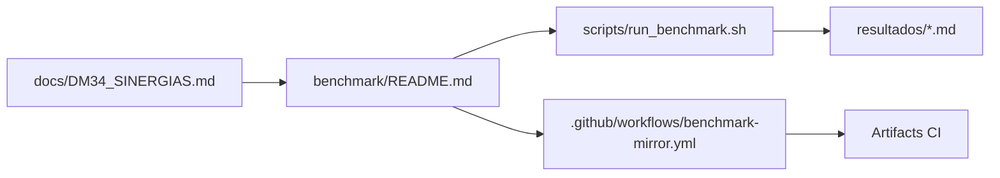

# DM-34 — Sinergias Dinâmicas da Semântica (BrowserRaf/internal)

> Escopo: somente `BrowserRaf/internal/`.
> Objetivo: elevar clareza, navegabilidade, confiabilidade, interoperabilidade e usabilidade documental sem alterar código-fonte de execução.

## 34 sinergias dinâmicas

| # | Sinergia | Aplicação prática no diretório |
|---|---|---|
| 1 | Clareza semântica | Definir propósito único por arquivo interno.
| 2 | Contrato de ABI explícito | Indicar ARM32/ARM64 e limites de uso JNI/NDK.
| 3 | Navegabilidade | Índices e links entre headers e módulos.
| 4 | Confiabilidade documental | Critérios de validação documentados.
| 5 | Interoperabilidade | Linguagem comum entre C, ASM, build e CI.
| 6 | Legibilidade progressiva | Camada rápida (overview) + camada profunda (detalhe).
| 7 | Tolerância a ruído | Seção “falhas conhecidas” com tratamento explícito.
| 8 | Rastreabilidade | Cada decisão ligada a arquivo/commit.
| 9 | Coesão estrutural | Evitar duplicidade de regra em múltiplos arquivos.
| 10 | Compatibilidade cruzada | Preservar Android API 28+ sem regressão.
| 11 | Transparência | Premissas, limites e riscos visíveis.
| 12 | Reprodutibilidade | Comandos idênticos local/CI para benchmark.
| 13 | Determinismo de build | Variáveis de ambiente declaradas.
| 14 | UX cognitiva | Texto objetivo com exemplos mínimos reproduzíveis.
| 15 | Curva de entrada baixa | “Comece aqui” com 3 passos.
| 16 | Segurança de release | Separar trilhas signed x unsigned.
| 17 | Governança de mudanças | Checklist de PR para docs/bench.
| 18 | Integridade de contexto | Não modificar hot path ao mexer em docs.
| 19 | Modularidade | benchmark isolado em subdiretório próprio.
| 20 | Observabilidade | Métricas p95/p99, throughput, erro.
| 21 | Falsificabilidade | Hipótese + condição de reprovação no benchmark.
| 22 | Coerência temporal | Registrar data e alvo do teste.
| 23 | Sinal > ruído | Sumário executivo antes do detalhe técnico.
| 24 | Acessibilidade textual | Português claro + termos técnicos padronizados.
| 25 | Auditoria mínima | Logs de build e artefatos versionáveis.
| 26 | Portabilidade de método | Mesmo pipeline em branch/fork.
| 27 | Disciplina de evidência | Sem “otimização” sem medição.
| 28 | Interação multipóblico | Dev nativo, QA, release manager, produto.
| 29 | Design ultra tecnológico | Visual de status por selos + fluxos.
| 30 | Sinestesia informacional | Texto + gráfico + tabela + imagem.
| 31 | Continuidade operacional | Plano de fallback documentado.
| 32 | Privacidade por padrão | Dados mínimos em logs.
| 33 | Resiliência de pipeline | Falha explícita antes de corrupção silenciosa.
| 34 | Aprendizado cumulativo | Registro de baseline e deltas comparáveis.

## Públicos-alvo e possibilidades

- **Engenharia Nativa (C/ASM/JNI):** mapa de contratos e benchmark de regressão.
- **Build/Release:** trilhas de assinatura, artefatos e matriz ABI.
- **QA/Perf:** execução repetível com coleta de latência e throughput.
- **Gestão técnica:** visão de risco, confiabilidade e governança.

## Visual de navegabilidade

## Exemplo de uso rápido

1. Ler `benchmark/README.md`.
2. Rodar `benchmark/scripts/run_benchmark.sh` localmente.
3. Comparar saída com artefato do workflow espelho.

## Selos recomendados para README local

- Build: 
- ABI: 
- Release safety: 
