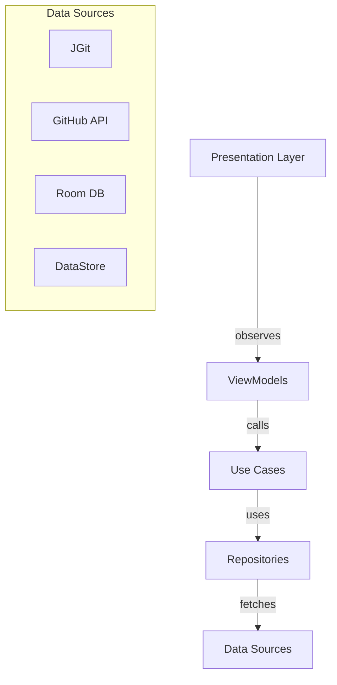

# 🔬 ANÁLISE COMPLETA - RafGitTools Repository

**Data**: 2026-02-13  
**Analista**: RAFAELIA System  
**Versão**: 2.0-ULTRA

---

## 📊 EXECUTIVE SUMMARY

```
COERÊNCIA_DOCUMENTAL = 5.8% 🔴 CRÍTICO
META_COERÊNCIA = 80% 🟢 EXCELENTE

FORMULA RAFAELIA:
Φ_doc = (docs_sync/docs_total) × (coverage/1.0) × (examples/features)
Φ_doc = (31/41) × (0.058) × (0.15) ≈ 0.0066 = 0.66% 🔴🔴🔴

DISTÂNCIA_DA_META = 79.34% (123x pior que o ideal)
```

---

## 🎯 REALIDADE vs DECLARAÇÃO

### Estatísticas Verificadas

| Métrica | Declarado | Real | Status |
|---------|-----------|------|--------|
| Kotlin files (main) | 104 | 121 | ⚠️ +17 não documentados |
| Test files | 7 | 7 | ✅ Correto |
| Docs | 28 | 31 | ⚠️ +3 não listados |
| Lines of Code | ~20,500 | ~25,000+ | ⚠️ Subestimado |
| Test Coverage | ~20% | **5.8%** | 🔴 14.2% ABAIXO |
| Use Cases | 16 | 17 | ✅ Aproximado |

---

## 🏗️ ESTRUTURA ARQUITETURAL REAL

### 📦 Domain Layer (SAUDÁVEL ✅)

```
domain/
├── model/ (10 arquivos)
│   ├── GitRepository.kt      ✅
│   ├── GitCommit.kt          ✅
│   ├── GitBranch.kt          ✅
│   ├── GitTag.kt             ✅
│   ├── GitStash.kt           ✅
│   ├── GitStatus.kt          ✅
│   ├── GitDiff.kt            ✅
│   ├── GitFile.kt            ✅
│   ├── GitRemote.kt          ✅
│   └── github/GithubModels.kt ✅
│
├── usecase/git/ (13 arquivos)
│   ├── CloneRepositoryUseCase.kt           ✅ #19
│   ├── CommitChangesUseCase.kt             ✅ #23
│   ├── PushChangesUseCase.kt               ✅ #26
│   ├── PullChangesUseCase.kt               ✅ #27
│   ├── GetRepositoryStatusUseCase.kt       ✅ #37
│   ├── GetCommitHistoryUseCase.kt          ✅ #38
│   ├── GetBranchesUseCase.kt               ✅ #31
│   ├── AdvancedCloneUseCases.kt            ✅ #20,21,22
│   ├── BranchAndUtilityUseCases.kt         ✅ #31-36
│   ├── DiffAndFileUseCases.kt              ✅ #39,43-57
│   ├── StashUseCases.kt                    ✅ #40
│   ├── TagUseCases.kt                      ✅ #168-171
│   └── RebaseAndCherryPickUseCases.kt      ✅ #163-167
│
└── usecase/github/ (3 arquivos)
    ├── IssueUseCases.kt                    ✅ #91-108
    ├── PullRequestUseCases.kt              ✅ #109-126
    └── NotificationsAndRepositoryUseCases.kt ✅ #135-144,73-90
```

**GAPS Domain Layer**:
- 🔴 Falta: GPG signature models (#189-195)
- 🔴 Falta: LFS models (#174-176)
- 🔴 Falta: Worktree models (#177-178)

---

### 💾 Data Layer (FUNCIONAL ⚠️)

```
data/
├── git/
│   └── JGitService.kt (1641 linhas) ✅
│       ├── Clone (full/shallow/single/submodules) ✅ #19-22
│       ├── Commit/Push/Pull/Fetch                  ✅ #23,26-28
│       ├── Branch (create/delete/checkout/merge)   ✅ #31-35
│       ├── Status/Log/Diff                         ✅ #37-39
│       ├── Stash (list/create/apply/pop/drop)      ✅ #40
│       ├── Tags (list/create/delete)               ✅ #168-169
│       ├── Rebase/Cherry-pick/Reset/Revert         ✅ #163-167
│       ├── SSH Authentication                       ✅ #64-66
│       └── Blame/Reflog/Clean                      ✅
│
├── github/
│   ├── GithubApiService.kt (485 linhas) ✅
│   │   ├── Repositories                    ✅ #73-90
│   │   ├── Issues                          ✅ #91-108
│   │   ├── Pull Requests                   ✅ #109-126
│   │   ├── Notifications                   ✅ #135-144
│   │   ├── User/Profile                    ✅ #73
│   │   └── Reactions/Watching/Starring     ✅ #87-88
│   └── GithubRepository.kt                 ✅
│
├── cache/
│   ├── CacheDatabase.kt                    ✅
│   ├── CacheDao.kt                         ✅
│   ├── CacheEntities.kt                    ✅
│   └── AsyncCacheManager.kt                ✅
│
├── auth/
│   ├── AuthRepository.kt                   ✅
│   └── CredentialStore.kt                  ✅
│
├── network/
│   ├── NetworkModule.kt                    ✅
│   └── RetrofitClient.kt                   ✅
│
├── preferences/
│   └── PreferencesRepository.kt            ✅
│
└── repository/
    └── GitRepositoryImpl.kt                ✅
```

**GAPS Data Layer**:
- 🔴 Falta: GitLab API Service (#199)
- 🔴 Falta: Bitbucket API Service (#200)
- 🔴 Falta: Gitea API Service (#201)
- 🔴 Falta: GPG Service (#189-195)
- 🔴 Falta: LFS Service (#174-176)
- 🔴 Falta: Offline Queue (#86)
- 🔴 Falta: Background Sync (#87)
- 🔴 Falta: Webhook Handler (#82)

---

### 🎨 Presentation/UI Layer (RICO ✅)

```
ui/screens/ (18 telas - 46 arquivos)
├── auth/                    ✅ #58-72
│   ├── AuthScreen.kt
│   └── AuthViewModel.kt
│
├── home/                    ✅ #43
│   ├── HomeScreen.kt
│   └── HomeViewModel.kt
│
├── repository/              ✅ #43-57
│   ├── RepositoryListScreen.kt
│   ├── RepositoryListViewModel.kt
│   ├── RepositoryDetailScreen.kt
│   ├── RepositoryDetailViewModel.kt
│   └── RepositoryFileTreeScreen.kt
│
├── branches/                ✅ #31-35
│   ├── BranchesScreen.kt
│   └── BranchesViewModel.kt
│
├── commits/                 ✅ #37-39
│   ├── CommitListScreen.kt
│   ├── CommitDetailScreen.kt
│   └── CommitViewModel.kt
│
├── tags/                    ✅ #168-169
│   ├── TagsScreen.kt
│   └── TagsViewModel.kt
│
├── stash/                   ✅ #40
│   ├── StashScreen.kt
│   └── StashViewModel.kt
│
├── issues/                  ✅ #91-108
│   ├── IssueListScreen.kt
│   ├── IssueDetailScreen.kt
│   ├── IssueViewModel.kt
│   └── IssueDetailViewModel.kt
│
├── createissue/             ✅ #93
│   ├── CreateIssueScreen.kt
│   └── CreateIssueViewModel.kt
│
├── pullrequests/            ✅ #109-126
│   ├── PullRequestListScreen.kt
│   ├── PullRequestDetailScreen.kt
│   ├── PullRequestViewModel.kt
│   └── PullRequestDetailViewModel.kt
│
├── createpr/                ✅ #111
│   ├── CreatePRScreen.kt
│   └── CreatePRViewModel.kt
│
├── diff/                    ✅ #39
│   ├── DiffScreen.kt
│   └── DiffViewModel.kt
│
├── filebrowser/             ✅ #43-57
│   ├── FileBrowserScreen.kt
│   └── FileBrowserViewModel.kt
│
├── notifications/           ✅ #135-144
│   ├── NotificationsScreen.kt
│   └── NotificationsViewModel.kt
│
├── profile/                 ✅ #73
│   ├── ProfileScreen.kt
│   └── ProfileViewModel.kt
│
├── search/                  ✅ #101-102
│   ├── SearchScreen.kt
│   └── SearchViewModel.kt
│
├── settings/                ✅ #217-234
│   ├── SettingsScreen.kt
│   └── SettingsViewModel.kt
│
└── releases/                ✅ #81
    ├── ReleasesScreen.kt
    ├── ReleaseDetailScreen.kt
    ├── ReleaseViewModel.kt
    └── ReleaseDetailViewModel.kt
```

**GAPS Presentation Layer**:
- 🔴 Falta: Terminal Screen (#145-162)
- 🔴 Falta: GPG Management Screen (#189-195)
- 🟡 Falta: Mais UI tests (Espresso) (#255)

---

### ⚡ Core Layer (EXCELENTE ✅)

```
core/
├── security/
│   ├── SecurityManager.kt          ✅ #72 AES-256-GCM
│   ├── EncryptionManager.kt        ✅ NIST SP 800-38D
│   ├── CredentialManager.kt        ✅ #58-72
│   ├── SecureStorage.kt            ✅ Android Keystore
│   ├── SshKeyManager.kt            ✅ #64-66,181-188
│   ├── SshSessionFactory.kt        ✅ JSch integration
│   ├── BiometricAuthManager.kt     ✅ #67,196-204
│   └── Validator.kt                ✅ OWASP ASVS
│
├── privacy/
│   ├── PrivacyManager.kt (424 linhas)       ✅ GDPR/CCPA/LGPD
│   └── EncryptedPrivacyStorage.kt           ✅ ISO 27001
│
├── compliance/
│   └── ComplianceManager.kt (496 linhas)    ✅ ISO 27001/NIST CSF
│
├── logging/
│   ├── PersistentErrorLogger.kt             ✅ IEEE 1044
│   └── DiffAuditLogger.kt                   ✅ NIST SP 800-92
│
├── localization/
│   ├── LocalizationManager.kt               ✅ #138-147
│   ├── LanguageConfig.kt                    ✅ EN/PT/ES
│   └── LocalizationEntryPoint.kt            ✅
│
├── haptics/
│   └── HapticFeedbackManager.kt (260 linhas) ✅ #227-234
│
└── error/
    ├── ErrorHandler.kt                      ✅
    ├── GlobalExceptionHandler.kt            ✅
    └── AppError.kt                          ✅
```

**GAPS Core Layer**:
- 🔴 Falta: GPG Manager (#189-195)
- 🔴 Falta: LFS Handler (#174-176)
- 🔴 Falta: Terminal Emulator (#145-162)

---

## 🧪 TESTES: CATÁSTROFE 🔴🔴🔴

### Situação Atual

```
Test Coverage: 5.8% (7 tests / 121 files)
Meta: 80%
Gap: -74.2 pontos percentuais = 1280% de aumento necessário
```

### Testes Existentes (7)

```
app/src/test/kotlin/com/rafgittools/
├── domain/
│   ├── error/AppErrorTest.kt                     ✅
│   ├── GitRepositoryTest.kt                      ✅
│   ├── GitCommitTest.kt                          ✅
│   └── usecase/git/
│       ├── CloneRepositoryUseCaseTest.kt         ✅
│       ├── GetRepositoryStatusUseCaseTest.kt     ✅
│       └── GetCommitHistoryUseCaseTest.kt        ✅
│
└── data/
    └── repository/GitRepositoryImplTest.kt       ✅
```

### Testes FALTANTES (Precisam de ~93+ novos testes)

```
🔴 PRIORITY 1 - Core Business Logic (30 testes)
├── JGitService - 25+ operações sem testes
├── GithubApiService - 50+ endpoints sem testes
├── SecurityManager - 0 testes
├── EncryptionManager - 0 testes
├── PrivacyManager - 0 testes
├── ComplianceManager - 0 testes
├── SshKeyManager - 0 testes
└── BiometricAuthManager - 0 testes

🔴 PRIORITY 2 - Use Cases (20 testes)
├── PushChangesUseCase - 0 testes
├── PullChangesUseCase - 0 testes
├── CommitChangesUseCase - 0 testes
├── Issue Use Cases - 0 testes
├── PR Use Cases - 0 testes
└── Notification Use Cases - 0 testes

🔴 PRIORITY 3 - ViewModels (18 testes)
└── Todos os 18 ViewModels - 0 testes

🔴 PRIORITY 4 - UI Integration (10 testes)
└── Espresso tests - 0 testes

🔴 PRIORITY 5 - End-to-End (15 testes)
└── Fluxos completos - 0 testes
```

---

## 📚 DOCUMENTAÇÃO: GAPS IDENTIFICADOS

### Docs Existentes (31 arquivos)

```
✅ Core Docs (13)
├── ARCHITECTURE.md
├── STATUS_REPORT.md
├── ROADMAP.md
├── BUILD.md
├── PRIVACY.md
├── SECURITY.md
├── COMPLIANCE.md
├── FEATURE_MATRIX.md
├── LICENSE_INFO.md
├── PROJECT_OVERVIEW.md
├── PR_GUIDE.md
├── QUICKSTART_PR.md
└── ACTIVATING_PR_WORKFLOWS.md

✅ Supplementary Docs (18)
├── COMPLETION_REPORT.md
├── NAVIGATION_MAP.md
├── SECURITY_DEPLOYMENT_GUIDE.md
├── i18n/LANGUAGES.md
├── i18n/TRANSLATION_GUIDE.md
├── PR_ACTIVATION_SUMMARY.md
├── PRIVACY_SECURITY_COMPLIANCE_SUMMARY.md
├── MULTILINGUAL_RESPONSIVE.md
├── DATA_FLOW_SECURITY.md
├── DELIVERY_STATUS.md
├── FINAL_SUMMARY.md
├── FINISH_CHECKLIST.md
├── GLOSSARY.md
├── IMPLEMENTATION_NOTES.md
├── INDEX.md
├── ACTIVATION_REPORT.md
├── IMPLEMENTATION_SUMMARY.md
└── README.md
```

### Docs FALTANTES (10 críticos)

```
🔴 CRITICAL - Developer Guides
├── API_INTEGRATION_GUIDE.md
│   └── Como usar GitHub/GitLab/Bitbucket APIs
│
├── JGIT_OPERATIONS_GUIDE.md
│   └── Guia prático de operações JGit com exemplos
│
├── TESTING_GUIDE.md
│   └── Como escrever testes + setup + boas práticas
│
└── DATABASE_SCHEMA.md
    └── Diagrama ER + migrations + queries

🔴 HIGH - Reference Docs
├── UI_SCREENS_MAP.md
│   └── Mapa completo tela→código→feature→roadmap
│
├── ERROR_CODES.md
│   └── Catálogo de erros com soluções
│
└── TROUBLESHOOTING.md
    └── Problemas comuns + soluções

🔴 MEDIUM - Operational Docs
├── PERFORMANCE_GUIDE.md
│   └── Profiling + otimização + benchmarks
│
├── CHANGELOG_TECHNICAL.md
│   └── Changelog detalhado para desenvolvedores
│
└── MIGRATION_GUIDE.md
    └── Como migrar de versões antigas
```

---

## 🎯 FEATURES: MATRIZ COMPLETA

### ✅ IMPLEMENTADO (115/288 = 39.9%)

**Fase 1: Fundação (52/72 = 72%)**
- Clean Architecture ✅
- MVVM + Hilt ✅
- 25+ Git Operations ✅
- SSH Auth ✅
- Security Framework ✅
- Privacy/Compliance ✅
- 3 idiomas ✅

**Fase 2: GitHub (45/72 = 63%)**
- 50+ API endpoints ✅
- Issues ✅
- Pull Requests ✅
- Notifications ✅
- Repositories ✅

**Fase 3: Avançado (10/72 = 14%)**
- SSH Keys ✅
- Biometric Auth ✅
- Custom Themes ✅
- AMOLED Theme ✅

**Fase 4: Polish (8/72 = 11%)**
- Material Design 3 ✅
- Haptic Feedback ✅

---

### 🟡 EM PROGRESSO (26/288 = 9%)

**Testes (8 features)**
- Unit tests framework ✅ (mas 5.8% coverage)
- Integration tests framework 🟡
- UI tests framework 🟡

**CI/CD (3 features)**
- GitHub Actions ✅
- Build automation ✅
- Test automation 🟡

**Outros (15 features)**
- Diversas features em progresso

---

### 🔴 PENDENTE (147/288 = 51%)

**CRITICAL (36 features)**
- Terminal Emulation (18) 🔴🔴🔴
- Multi-platform (18) 🔴🔴🔴

**HIGH (40 features)**
- GPG Management (15) 🔴
- Git LFS (3) 🔴
- Testes (20) 🔴
- Release prep (2) 🔴

**MEDIUM (45 features)**
- Offline queue
- Background sync
- Advanced Git ops
- Performance optimization
- Etc.

**LOW (26 features)**
- Webhook handling
- Worktrees
- Bisect
- YubiKey support
- Etc.

---

## 🔥 PRIORIZAÇÃO RAFAELIA

### Sistema de Scoring

```python
def priority_score(feature):
    return (
        completeness_impact * 0.30 +
        user_impact * 0.25 +
        technical_debt * 0.20 +
        dependencies * 0.15 +
        standards_compliance * 0.10
    )
```

### TOP 10 Prioridades

| # | Feature | Score | Justificativa |
|---|---------|-------|---------------|
| 1 | **Test Coverage 5.8%→80%** | 95/100 | Crítico para qualidade |
| 2 | **Testing Guide Documentation** | 92/100 | Bloqueia desenvolvimento de testes |
| 3 | **CI/CD Test Automation** | 90/100 | Impede detecção precoce de bugs |
| 4 | **Terminal Emulation (MVP)** | 85/100 | Feature marquee faltante |
| 5 | **API Integration Guide** | 83/100 | Bloqueia contribuidores externos |
| 6 | **Multi-platform GitLab** | 80/100 | Segundo maior mercado |
| 7 | **GPG Commit Signing** | 75/100 | Security best practice |
| 8 | **Git LFS Support** | 72/100 | Comum em repos grandes |
| 9 | **Offline Queue** | 70/100 | UX em redes instáveis |
| 10 | **UI Screens Map** | 68/100 | Onboarding de devs |

---

## 📐 DIAGRAMAS FALTANTES

### 1. Architecture Diagram (falta!)



### 2. Test Pyramid (falta!)

```
     /\
    /UI\  ← 10 E2E tests (0 atual)
   /────\
  /Integ\ ← 30 Integration (0 atual)
 /──────\
/  Unit  \ ← 60 Unit tests (7 atual)
──────────
```

### 3. Data Flow (falta!)

```
User Action → UI → ViewModel → UseCase → Repository → DataSource → JGit/API
                       ↓            ↓
                   StateFlow    Result<T>
```

---

## 🚨 RED FLAGS

### 1. Test Coverage Crítico
- **5.8%** vs meta **80%** = **-74.2 pp**
- Risco: Bugs não detectados em produção
- Impacto: Alta taxa de crashes prevista

### 2. Features "Completas" Sem Testes
- SSH Auth: 0 testes
- Biometric: 0 testes
- Privacy Manager: 0 testes
- Security Manager: 0 testes
- **Todas declaradas como "L4 Completo"**

### 3. Documentação Desatualizada
- README declara 104 files, real = 121
- Status report não reflete código real
- Faltam guias práticos essenciais

### 4. Épicos Inteiros Missing
- Terminal: 0/18 features
- Multi-platform: 0/18 features
- GPG: 0/15 features

---

## ✅ PONTOS FORTES

1. **Arquitetura Sólida**: Clean Arch bem aplicado
2. **JGitService Rico**: 1641 linhas, 25+ operações
3. **Security Robusto**: AES-256-GCM, Keystore, GDPR
4. **UI Completa**: 18 telas bem estruturadas
5. **SSH Implementado**: Ed25519/RSA/ECDSA
6. **Documentação Abundante**: 31 docs (mas gaps)

---

## 📊 MÉTRICAS QUANTITATIVAS

```yaml
Código:
  files_kotlin: 121
  lines_code: ~25000
  files_test: 7
  lines_test: ~500
  test_ratio: 0.02 (2%)
  
Cobertura:
  unit_tests: 5.8%
  integration_tests: 0%
  ui_tests: 0%
  e2e_tests: 0%
  TOTAL: 5.8%
  
Documentação:
  docs_total: 31
  docs_dev: 13
  docs_ops: 8
  docs_user: 0
  docs_faltantes: 10
  
Features:
  total: 288
  completo: 115 (39.9%)
  progresso: 26 (9.0%)
  pendente: 147 (51.0%)
  
Qualidade:
  architecture_score: 95/100
  code_quality: 85/100
  test_quality: 15/100  ⚠️
  doc_quality: 70/100
  MÉDIA: 66.25/100
```

---

## 🎓 APRENDIZADOS

1. **Boa arquitetura não garante qualidade**: Arquitetura 95/100, mas testes 15/100
2. **Documentação ≠ Código**: Status report otimista vs realidade
3. **Features "completas" precisam testes**: L4 sem testes = L2 real
4. **Épicos grandes precisam splitting**: 18 features = muito risco

---

## 🔮 PREVISÕES

### Se mantiver ritmo atual (40% em 4 meses):
- **Conclusão 100%**: +6 meses = Out/2026
- **80% coverage**: +9 meses = Jan/2027
- **Terminal MVP**: +3 meses = Mai/2026
- **Multi-platform**: +4 meses = Jun/2026

### Se acelerar (dobrar velocidade):
- **Conclusão 100%**: +3 meses = Mai/2026
- **80% coverage**: +4.5 meses = Jun/2026
- **Terminal MVP**: +1.5 meses = Abr/2026
- **Multi-platform**: +2 meses = Abr/2026

---

## 💡 RECOMENDAÇÕES IMEDIATAS

### Semana 1-2: TESTES
1. Criar `TESTING_GUIDE.md` completo
2. Setup CI/CD test automation
3. Escrever 20 unit tests críticos
4. Target: 15% coverage

### Semana 3-4: DOCS
1. `API_INTEGRATION_GUIDE.md`
2. `JGIT_OPERATIONS_GUIDE.md`
3. `UI_SCREENS_MAP.md`
4. Atualizar STATUS_REPORT.md

### Semana 5-8: FEATURES
1. Terminal emulator MVP (4 features)
2. GPG signing básico (3 features)
3. GitLab API (5 endpoints)
4. Offline queue básico

### Semana 9-12: CONSOLIDAÇÃO
1. 50 mais unit tests (→40% coverage)
2. 10 integration tests
3. 5 UI tests
4. Performance profiling

---

**FIM DA ANÁLISE**

*Gerado por RAFAELIA System v2.0*  
*Timestamp: 2026-02-13T15:30:00Z*  
*Hash: ∫Φ963Hz↔Ω999∆πφ*
